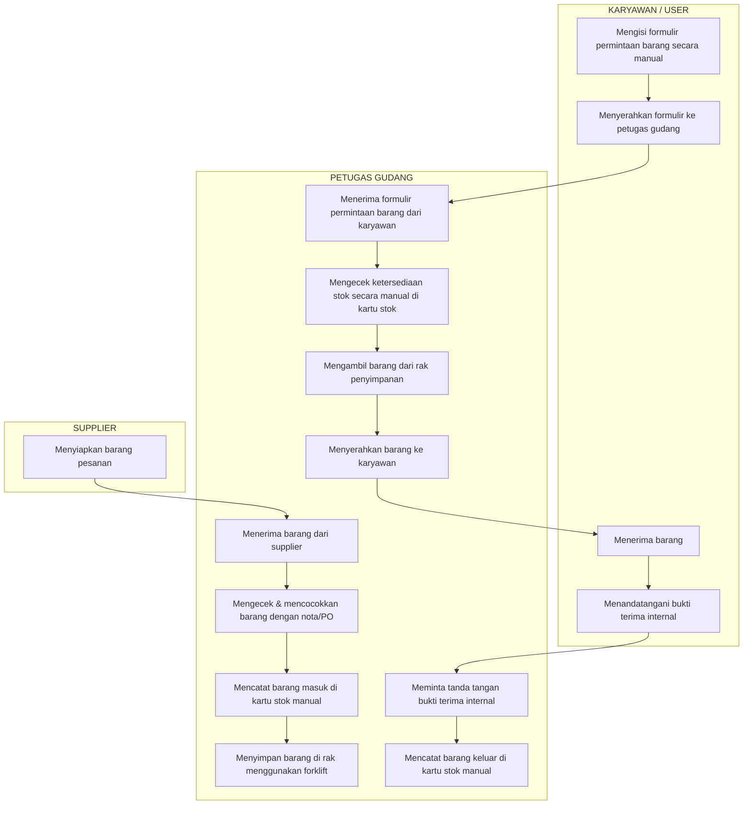
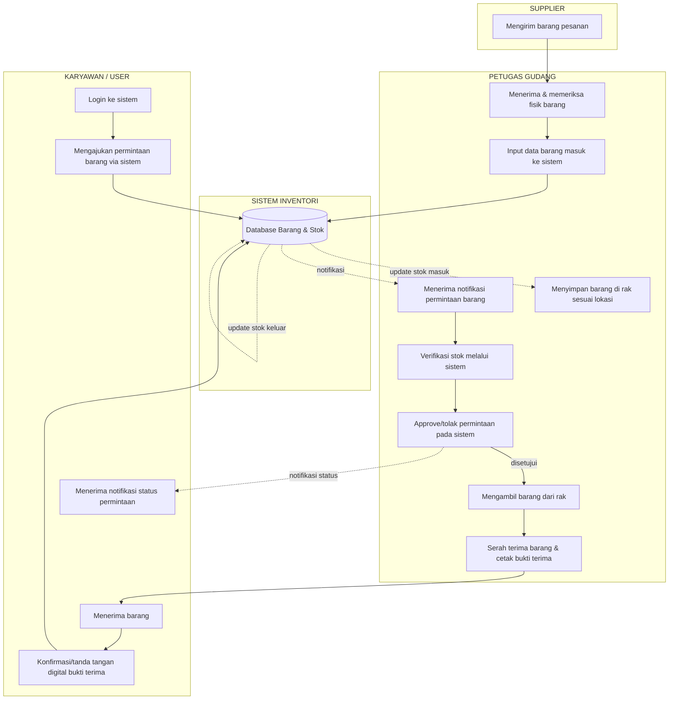
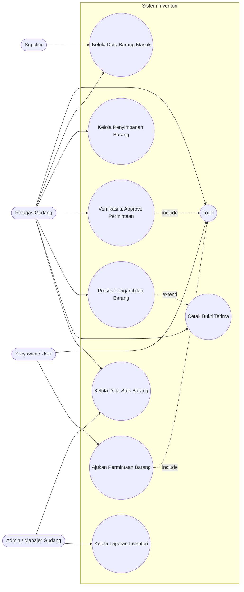
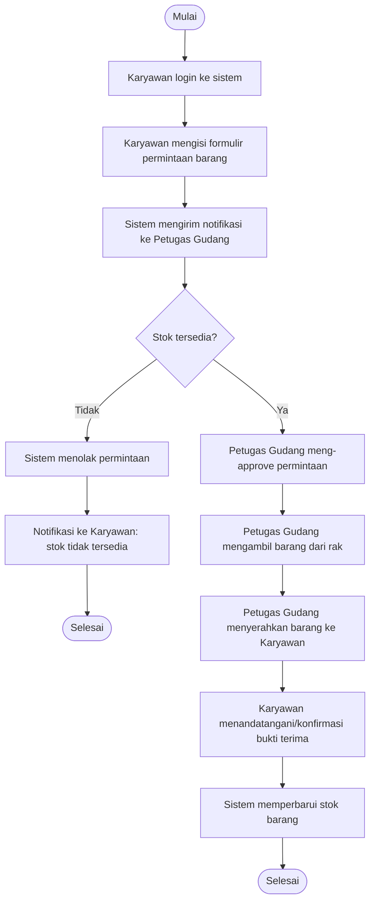
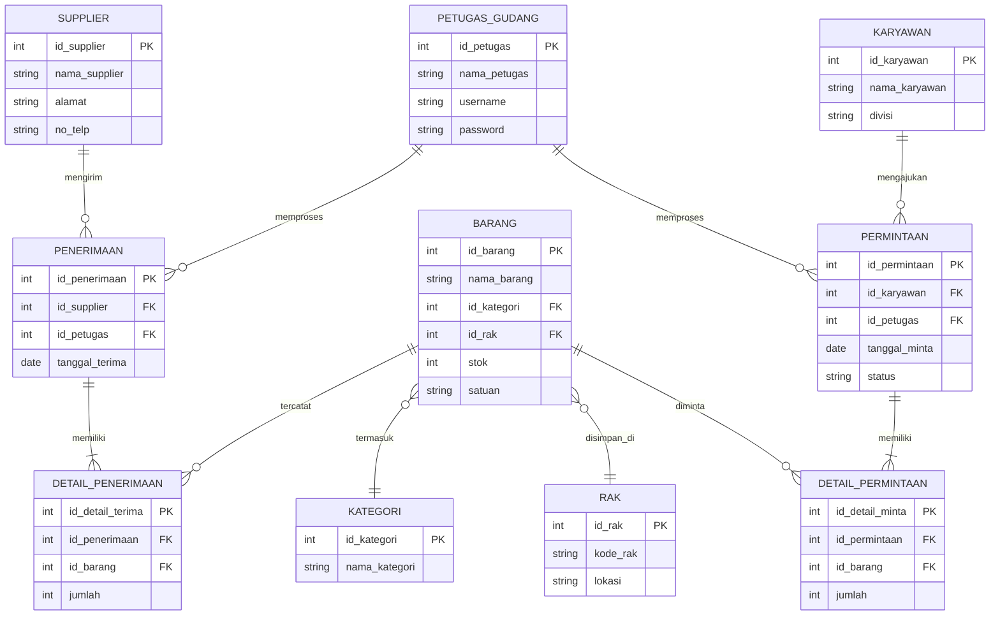
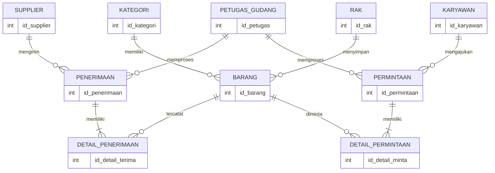

[ INI BUKAN FILE BERSANGKUTAN DENGAN FRAWORK INI ABAIKAN SAJA ]

# Tugas 1 — Perancangan Sistem Inventori

**Nama Lengkap :** _____________________
**Kelas :** _____________________

---

## 1. Flowmap Berjalan (Sistem Manual/Saat Ini)

Berdasarkan ilustrasi yang diberikan, proses saat ini masih dilakukan secara manual: petugas gudang mencatat barang masuk/keluar dengan kartu stok, dan karyawan mengajukan permintaan barang menggunakan formulir kertas.

**Kelemahan sistem berjalan:** pencatatan rawan hilang/rusak, rekap stok memakan waktu, tidak ada laporan real-time, dan rawan human error saat pencocokan stok.

---

## 2. Flowmap yang Diajukan (Sistem Terkomputerisasi)

Flowmap usulan menambahkan **sistem inventori terkomputerisasi** sebagai pusat pencatatan data barang, stok, dan transaksi, sehingga proses pencatatan manual digantikan input & validasi sistem.

**Manfaat sistem usulan:** stok ter-update otomatis dan real-time, pengajuan permintaan lebih cepat & terlacak (ada status), laporan bisa dicetak kapan saja, dan mengurangi human error pencatatan manual.

---

## 3. Use Case Diagram

Aktor yang teridentifikasi: **Supplier**, **Petugas Gudang**, **Karyawan (User)**, dan **Admin/Manajer Gudang** (untuk pelaporan).

---

## 4. Usecase Scenario

**a. Usecase: Ajukan Permintaan Barang**

| Item | Keterangan |
|---|---|
| Nama Usecase | Ajukan Permintaan Barang |
| Aktor | Karyawan (User) |
| Deskripsi | Karyawan mengajukan permintaan barang kepada petugas gudang melalui sistem |
| Pre-condition | Karyawan sudah login ke sistem |
| Main Flow | 1. Karyawan memilih menu "Permintaan Barang" 2. Karyawan memilih barang & jumlah yang dibutuhkan 3. Sistem menampilkan konfirmasi 4. Karyawan mengirim permintaan 5. Sistem menyimpan data & mengirim notifikasi ke Petugas Gudang |
| Alternate Flow | Jika stok tidak mencukupi, sistem menampilkan peringatan sebelum permintaan dikirim |
| Post-condition | Data permintaan tersimpan dengan status "Menunggu Persetujuan" |

**b. Usecase: Kelola Data Barang Masuk**

| Item | Keterangan |
|---|---|
| Nama Usecase | Kelola Data Barang Masuk |
| Aktor | Petugas Gudang |
| Deskripsi | Petugas gudang mencatat barang yang diterima dari supplier ke dalam sistem |
| Pre-condition | Barang fisik telah tiba dan diperiksa kesesuaiannya |
| Main Flow | 1. Petugas login ke sistem 2. Memilih menu "Penerimaan Barang" 3. Memilih supplier & barang yang diterima 4. Menginput jumlah barang 5. Sistem memperbarui stok secara otomatis |
| Alternate Flow | Jika barang tidak sesuai pesanan, petugas mencatat catatan retur |
| Post-condition | Stok barang bertambah dan tercatat pada sistem |

---

## 5. Activity Diagram

Activity diagram berikut menggambarkan alur proses permintaan barang oleh karyawan hingga barang diterima.

---

## 6. ERD (Entity Relationship Diagram)

# Singkat Version

---

## 7. Skema Database

**Tabel: supplier**
| Field | Tipe Data | Keterangan |
|---|---|---|
| id_supplier | INT | PK, AUTO_INCREMENT |
| nama_supplier | VARCHAR(100) | |
| alamat | VARCHAR(255) | |
| no_telp | VARCHAR(20) | |

**Tabel: kategori**
| Field | Tipe Data | Keterangan |
|---|---|---|
| id_kategori | INT | PK, AUTO_INCREMENT |
| nama_kategori | VARCHAR(50) | |

**Tabel: rak**
| Field | Tipe Data | Keterangan |
|---|---|---|
| id_rak | INT | PK, AUTO_INCREMENT |
| kode_rak | VARCHAR(20) | |
| lokasi | VARCHAR(100) | |

**Tabel: barang**
| Field | Tipe Data | Keterangan |
|---|---|---|
| id_barang | INT | PK, AUTO_INCREMENT |
| nama_barang | VARCHAR(100) | |
| id_kategori | INT | FK → kategori.id_kategori |
| id_rak | INT | FK → rak.id_rak |
| stok | INT | |
| satuan | VARCHAR(20) | |

**Tabel: petugas_gudang**
| Field | Tipe Data | Keterangan |
|---|---|---|
| id_petugas | INT | PK, AUTO_INCREMENT |
| nama_petugas | VARCHAR(100) | |
| username | VARCHAR(50) | UNIQUE |
| password | VARCHAR(255) | (hash) |

**Tabel: karyawan**
| Field | Tipe Data | Keterangan |
|---|---|---|
| id_karyawan | INT | PK, AUTO_INCREMENT |
| nama_karyawan | VARCHAR(100) | |
| divisi | VARCHAR(50) | |

**Tabel: penerimaan** (transaksi barang masuk)
| Field | Tipe Data | Keterangan |
|---|---|---|
| id_penerimaan | INT | PK, AUTO_INCREMENT |
| id_supplier | INT | FK → supplier.id_supplier |
| id_petugas | INT | FK → petugas_gudang.id_petugas |
| tanggal_terima | DATE | |

**Tabel: detail_penerimaan**
| Field | Tipe Data | Keterangan |
|---|---|---|
| id_detail_terima | INT | PK, AUTO_INCREMENT |
| id_penerimaan | INT | FK → penerimaan.id_penerimaan |
| id_barang | INT | FK → barang.id_barang |
| jumlah | INT | |

**Tabel: permintaan** (transaksi barang keluar)
| Field | Tipe Data | Keterangan |
|---|---|---|
| id_permintaan | INT | PK, AUTO_INCREMENT |
| id_karyawan | INT | FK → karyawan.id_karyawan |
| id_petugas | INT | FK → petugas_gudang.id_petugas |
| tanggal_minta | DATE | |
| status | ENUM('Menunggu','Disetujui','Ditolak','Selesai') | |

**Tabel: detail_permintaan**
| Field | Tipe Data | Keterangan |
|---|---|---|
| id_detail_minta | INT | PK, AUTO_INCREMENT |
| id_permintaan | INT | FK → permintaan.id_permintaan |
| id_barang | INT | FK → barang.id_barang |
| jumlah | INT | |

---

*Catatan: seluruh jawaban di atas merupakan hasil analisis dan perancangan berdasarkan skenario pada gambar referensi tugas — silakan disesuaikan dengan ketentuan/format dari dosen/pengajar masing-masing.*